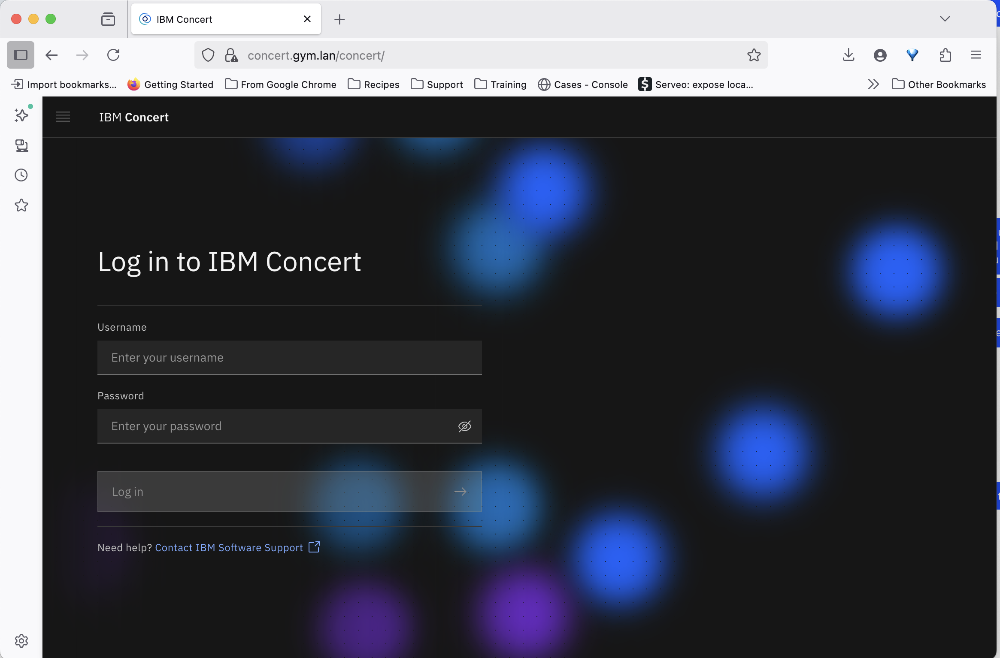

# terraform-k3s-concert

## Requirements

* [Terraform](https://www.terraform.io/) - Terraform is an open-source infrastructure as code software tool that provides a consistent CLI workflow to manage hundreds of cloud services. Terraform codifies cloud APIs into declarative configuration files.
* vSphere account - Access to vSphere with the proper authorization to create VMs

---

## Before you start

You will need an IBM entitlement key to install AIOps. This can be obtained [here](https://myibm.ibm.com/products-services/containerlibrary).

You will also need a valid Red Hat subscription and registration key if using RHEL templates.

---

## IBM TechZone Access to vSphere

If you are an IBMer or Business Parter, you can request access to vSphere through IBM TechZone.

[VMware on IBM Cloud Environments](https://techzone.ibm.com/collection/tech-zone-certified-base-images/journey-vmware-on-ibm-cloud-environments)

Select `Request vCenter access (OCP Gym)`

---

This asset will deploy a k3s cluster to a vmware environment.

The ultimate goal is to automate the installation of IBM Concert.

For now, this automation depends on using a VMware environment. Future updates to the code will take into account other environments.

This deploys a fully functional IBM Concert environment to K3s.

## Prerequisites

This playbook requires the existence of an valid template to use in vsphere. You can create this template following the directions [here](https://github.com/ibm-client-engineering/packer-rhel-vsphere)

Make sure ansible is installed: 

On your bastion host (comes with the techzone environment if you are using the OCP Gymnasium in IBM Techzone)

Install Ansible: 
```tsx
sudo dnf -y install ansible
```
Install Terraform: 
```tsx
sudo dnf -y install yum-utils
sudo yum-config-manager --add-repo https://rpm.releases.hashicorp.com/RHEL/hashicorp.repo
sudo dnf -y install terraform 
```
Clone this repo down
```tsx
git clone https://github.com/ibm-client-engineering/terraform-k3s-concert.git
```

In the `terraform-k3s-concert` directory, initialize terraform
```tsx
cd terraform-k3s-concert
terraform init
```
Install the ansible requirements
```tsx
cd ansible
sudo pip3 install -r requirements.txt
```

Also you will need helm installed as well:

```tsx
curl -fsSL -o get_helm.sh https://raw.githubusercontent.com/helm/helm/main/scripts/get-helm-3
chmod 700 get_helm.sh
sudo ./get_helm.sh
```

This will install helm to `/usr/local/bin/helm`

Finally, install kubectl. This can be done using the RHEL native package management or via curl command. Options for installation can be found [here](https://v1-32.docs.kubernetes.io/docs/tasks/tools/install-kubectl-linux/)

Add the Kubernetes yum repository. If you want to use Kubernetes version different than v1.32, replace v1.32 with the desired minor version in the command below. 
```tsx
# This overwrites any existing configuration in /etc/yum.repos.d/kubernetes.repo
cat <<EOF | sudo tee /etc/yum.repos.d/kubernetes.repo
[kubernetes]
name=Kubernetes
baseurl=https://pkgs.k8s.io/core:/stable:/v1.32/rpm/
enabled=1
gpgcheck=1
gpgkey=https://pkgs.k8s.io/core:/stable:/v1.32/rpm/repodata/repomd.xml.key
EOF
```

```tsx
sudo dnf -y install kubectl
```

## Configure Networking

> 💡 **Important:** Currently this Terraform module assumes that the network is **192.168.252.0/24**.
> This is hard-coded into the module, sorry.

#### Required Static IPs

There are 6 static IP addresses that are needed.

| Type         | Hostname       | IP               | FQDN                  |
|--------------|----------------|------------------|------------------------|
| `nfs-server` | `nfs-server`   | `192.168.252.7`  | `nfs-server.gym.lan`   |
| `haproxy`    | `haproxy`      | `192.168.252.9`  | `haproxy.gym.lan`      |
| `concert`    | `concert`      | `192.168.252.9`  | `concert.gym.lan`      |
| `k3s server` | `k3s-server-0` | `192.168.252.10` | `k3s-server-0.gym.lan` |
| `k3s server` | `k3s-server-1` | `192.168.252.11` | `k3s-server-1.gym.lan` |
| `k3s server` | `k3s-server-2` | `192.168.252.12` | `k3s-server-2.gym.lan` |

The example table above assumes the `base_domain` is set to `gym.lan`

The `concert.gym.lan` ultimately points to the same ip as haproxy. This is necessary with an nginx ingress. In a typical installation you would wildcard the domain (eg: `*.apps.gym.lan`) or something similar and have it CNAME to the haproxy, but the pfsense firewall doesn't support wildcard domains.

#### 🛠️ How to Set Static IPs in pfSense

1. **Log in to pfSense** via the web UI (usually at `https://192.168.252.1`).
2. Navigate to:  
   **Services** → **DNS Forwarder**.
3. Scroll down to **Host Overrides**.
4. For each device:
   - Click **Add**.
   - Set the **IP address** (from the table above).
   - Set the **Hostname** (e.g., `haproxy`).
   - Set the **Domain** to `gym.lan` (or appropriate base domain) to form the FQDN.
   - Click **Save**.
5. Click **Apply Changes** at the top of the page.

#### 🧭 Enable DNS Forwarder Static Mapping Registration in pfSense

To ensure that your static DHCP mappings (like `k3s-agent-0.gym.lan`, etc.) are resolvable via DNS, you need to enable a specific setting in pfSense:

##### ✅ Steps

1. Log in to the **pfSense Web UI**.
2. Navigate to:  
   **Services** → **DNS Forwarder**.
3. Scroll down to the **General DNS Forwarder Options** section.
4. Check the box for: **Register DHCP static mappings in DNS forwarder**
5. Click **Save** and then **Apply Changes**.

> 💡 This setting controls whether hostnames assigned to static DHCP clients are automatically added to the DNS forwarder or resolver so they can be resolved locally.


## Running terraform to build the nodes

Create a `terraform.tfvars` in the `terraform-k3s-concert` you cloned. This is an example of what it should look like:
```tsx
// Base domain from which the cluster domain is a subdomain.
base_domain = "gym.lan" # Typical for OCP Gym environments

// Name of the vSphere server. The dev cluster is on "vcsa.vmware.devcluster.openshift.com".
vsphere_server = "ocpgym-vc.techzone.ibm.local"

// User on the vSphere server.
vsphere_user = "<VSPHERE USER>"

// Password of the user on the vSphere server.
vsphere_password = "<VSPHERE PASSWORD>"

// Name of the vSphere cluster. The dev cluster is "devel".
cluster_name = "ocp-gym"

// Name of the vSphere data center. The dev cluster is "dc1".
datacenter_name = "IBMCloud"

// Name of the vSphere data store to use for the VMs. The dev cluster uses "nvme-ds1".
datastore_name = "<DATASTORE NAME>"

// Name of the RHCOS VM template to clone to create VMs for the cluster
//template_name = "ocp-gym/reservations/68adb1baa3606724922136a7/linux-rhel-9.4-main"
template_name = ""

// Name of the VM Network for your cluster nodes
vm_network_name = ""

vsphere_folder = ""

k3s_agent_count = 6

ibm_entitlement_key = ""

accept_license      = "true"

ignore_prereqs      = true

rhsm_username = ""
rhsm_password = ""
vsphere_resource_pool                = ""
use_nfs = true
```

The vsphere values can be determined from the vsphere console.

## Building the nodes and haproxy

Kick off terraform with the below command:

```tsx
terraform apply
```

Terraform should build the following 3 server nodes by default:

- k3s-server-0.gym.lan
- k3s-server-1.gym.lan
- k3s-server-2.gym.lan

And then whatever number of agent nodes you put in your tfvars. This is set to 6 in our example

- k3s-agent-0.gym.lan
- k3s-agent-1.gym.lan
- k3s-agent-2.gym.lan
- k3s-agent-3.gym.lan
- k3s-agent-4.gym.lan
- k3s-agent-5.gym.lan

It will also create an haproxy host
- haproxy.gym.lan

And an nfs server to serve as the cluster file storage
- nfs-server.gym.lan

When Terraform completes the build, it will generate the following two files in the ansible sub directory:
- `inventory.ini`
- `rhel_sub.ini`

## Installing via ansible

The tasks that ansible performs are installing the k3s cluster, configuring the cluster, and deploying IBM Concert and Concert Hub to the k3s cluster. This can be kicked off with the following command in the `ansible` directory:

```tsx
ansible-playbook playbook.yaml -i inventory.ini -e @rhel_sub.yaml
```

## Extras

All things with Ansible can be controlled with tags. The following tags are relevant for separate installation or configuration tasks:


`k3s-uninstall` - This is a pseudo nuclear option. It completely uninstalls k3s from the nodes regardless of whatever you've deployed to the cluster.

Other tags to be documented later


## Ingress

TBD

## Accessing the cluster

```tsx
export KUBECONFIG=/path/to/terraform-k3s-concert/ansible/kubeconfig.yaml

kubectl get nodes
NAME                   STATUS   ROLES                       AGE   VERSION
k3s-agent-0.gym.lan    Ready    <none>                      79m   v1.33.4+k3s1
k3s-agent-1.gym.lan    Ready    <none>                      79m   v1.33.4+k3s1
k3s-agent-2.gym.lan    Ready    <none>                      79m   v1.33.4+k3s1
k3s-agent-3.gym.lan    Ready    <none>                      79m   v1.33.4+k3s1
k3s-agent-4.gym.lan    Ready    <none>                      79m   v1.33.4+k3s1
k3s-agent-5.gym.lan    Ready    <none>                      79m   v1.33.4+k3s1
k3s-server-0.gym.lan   Ready    control-plane,etcd,master   80m   v1.33.4+k3s1
k3s-server-1.gym.lan   Ready    control-plane,etcd,master   79m   v1.33.4+k3s1
k3s-server-2.gym.lan   Ready    control-plane,etcd,master   79m   v1.33.4+k3s1
```

the `kubeconfig.yaml` file is generated by ansible after k3s is installed.


## Logging in to Concert

In a browser open the concert url (https://concert.gym.lan). You MUST be connected to the Wireguard VPN configured with your techzone reservation.



Login: "admin"
Password: "P@ssw0rd!"

These are set in `ansible/group_vars/all.yml` and can be overridden at cmdline when kicking off the playbook

```
concert_user: "admin"
concert_password: "P@ssw0rd!"
```